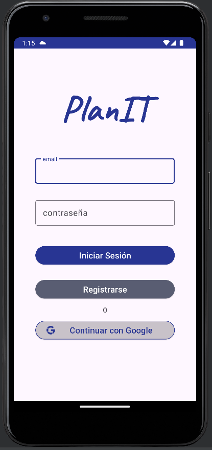
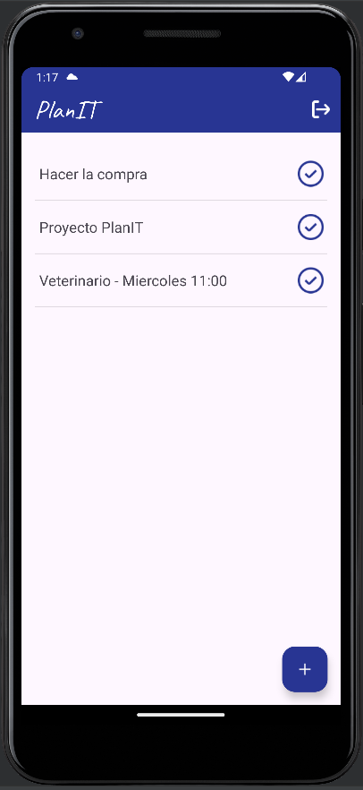

# PlanIT - Tu gestor de tareas diarias

## Descripción
PlanIT es una aplicación avanzada para Android que facilita la gestión de tareas diarias. Este proyecto se destaca por su integración con Firebase, lo que proporciona una robusta solución de backend. Se utiliza Firebase para la autenticación de usuarios, permitiendo el registro y el inicio de sesión a través de correo electrónico o Google. Además, Firebase Firestore se emplea para almacenar y sincronizar las tareas en tiempo real, asegurando que los usuarios puedan acceder a sus listas desde cualquier dispositivo. La interfaz de la aplicación es intuitiva y fácil de usar, permitiendo a los usuarios gestionar sus tareas con eficacia.

## Características
- **Autenticación**: Registro e inicio de sesión seguros con Firebase Authentication.
- **Sincronización en tiempo real**: Las tareas se sincronizan en tiempo real con Firebase Firestore.
- **Interfaz amigable**: Fácil de navegar y usar para la gestión diaria de tareas.
- **Gestión de tareas**: Agregar, editar, eliminar y marcar tareas como completadas.

## Instalación
2. Abre la aplicación y regístrate o inicia sesión.
3. Comienza a agregar tus tareas.

## Uso
### Agregar una nueva tarea
1. Haz clic en el botón de agregar tarea.
2. Introduce el nombre de la tarea y confirma.

### Completar o editar una tarea
- Para marcar una tarea como completada, selecciona la tarea y elige la opción correspondiente.
- Para editar una tarea, haz clic en la tarea y modifica los detalles necesarios.

